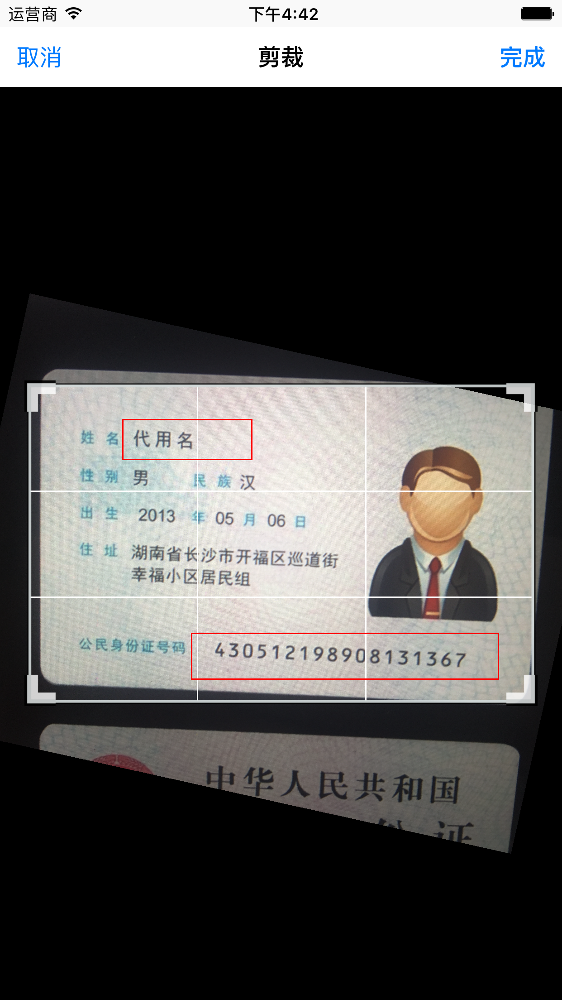
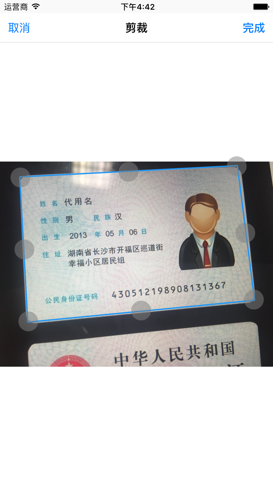
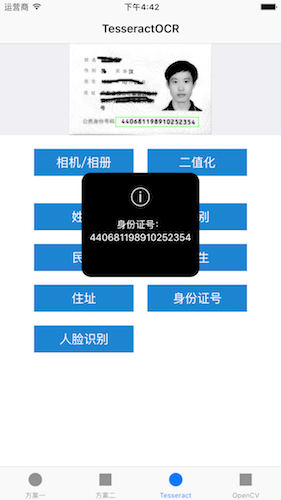

#IDCardScanner

[](https://travis-ci.org/nextsun/IDCardScanner)


IDCardScanner is a demo app to recognize China Identity Card informations on iOS platform.


## Screenshots







##Install on iPhone

#### One

* Click  [here](https://dn-nextsun.qbox.me/itms-services.html?action=download-manifest&url=https://raw.githubusercontent.com/nextsun/IDCardScanner/master/Docs/Publish/app.plist)  on your iPhone or iPad to install it directly.

#### Two


* Download the install package file [here](https://raw.githubusercontent.com/nextsun/IDCardScanner/master/Docs/Publish/app.ipa).


## Run

This project is build With [CocoaPods](http://cocoapods.org), so please run the following command to install  before opening with Xcode.

    pod install


## Usage

### Pick Image


There are two method to select the area to recognize,

One is picked  by the user  show in Case One,

We use this controller to pick:

```

    PECropViewController *controller = [[PECropViewController alloc] init];    
    controller.title = @"剪裁";
    controller.delegate = self;   
    controller.image = self.imageView.image;
    controller.toolbarHidden= YES;
    controller.cropAspectRatio =  856.0/540.0;
    controller.keepingCropAspectRatio = YES;

    
    UINavigationController *navigationController = [[UINavigationController alloc] initWithRootViewController:controller];
    [self presentViewController:navigationController animated:YES completion:nil];

```

and before rending this controller ,we use those code to inject the area to  recognized:

```
    
    [PECropRectView aspect_hookSelector:@selector(initWithFrame:) withOptions:AspectPositionAfter usingBlock:^(id<AspectInfo> aspectInfo, CGRect frame) {
       
        PECropRectView* cropRectView = aspectInfo.instance;
        cropRectView.IDCardNameView = [[UIView alloc] initWithFrame:CGRectZero];
        cropRectView.IDCardNameView.layer.borderWidth = 1;
        cropRectView.IDCardNameView.layer.borderColor = [UIColor redColor].CGColor;
        [cropRectView addSubview:cropRectView.IDCardNameView];
        
        
        cropRectView.IDCardNumberView = [[UIView alloc] initWithFrame:CGRectZero];
        cropRectView.IDCardNumberView.layer.borderWidth = 1;
        cropRectView.IDCardNumberView.layer.borderColor = [UIColor redColor].CGColor;
        [cropRectView addSubview:cropRectView.IDCardNumberView];
        
        
    } error:NULL];
    
    
    [PECropRectView aspect_hookSelector:@selector(layoutSubviews) withOptions:AspectPositionAfter usingBlock:^(id<AspectInfo> aspectInfo) {
        PECropRectView* cropRectView = aspectInfo.instance;
        float scale = cropRectView.bounds.size.width /  856;
        cropRectView.IDCardNameView.frame = CGRectMake(160*scale, 60*scale, 220*scale, 70*scale);
        cropRectView.IDCardNumberView.frame = CGRectMake(276*scale, 420*scale, 520*scale, 80*scale);
    
    } error:NULL];
}
```


The other is picked automatic by OpenCV, but it also can be adjust by user.

We open the picker controller like this:

```

    CropViewController *crop=[[CropViewController alloc] init];
    crop.cropdelegate=self;    
    crop.title = @"剪裁";
    crop.adjustedImage=image;
    
    [picker pushViewController:crop animated:YES];

```

and  then it will show picked area automatic. 

if you want to know more details, please download this project.


### Recognize Image

We use  tesseract to recoginze the image , here is the core code:

```
    
    CGRect nameRect = CGRectMake(160, 60, 220, 70);
    CGRect IDNumberRect = CGRectMake(276, 420, 520, 80);
    
    G8RecognitionOperation *operation = [[G8RecognitionOperation alloc] initWithLanguage:@"chi_sim"];
    operation.tesseract.delegate=self;
    operation.tesseract.rect = nameRect;
    operation.recognitionCompleteBlock = ^(G8Tesseract *recognizedTesseract) {
        NSLog(@" OCR TEXT NAME: %@", [recognizedTesseract recognizedText]);
        self.nameLabel.text =[@"姓名:" stringByAppendingString: [recognizedTesseract recognizedText]];
    };
    
    
    // Add operation to queue
    NSOperationQueue *queue = [[NSOperationQueue alloc] init];
    [queue addOperation:operation];
    
    
    
    
    G8RecognitionOperation *operation2 = [[G8RecognitionOperation alloc] initWithLanguage:@"chi_sim"];
    
    // Configure inner G8Tesseract object as described before
    operation2.tesseract.charWhitelist = @"1234567890X";
    operation2.tesseract.image = [image g8_blackAndWhite];
    operation2.tesseract.delegate=self;
    operation2.tesseract.rect = IDNumberRect;
    // Setup the recognitionCompleteBlock to receive the Tesseract object
    // after text recognition. It will hold the recognized text.
    operation2.recognitionCompleteBlock = ^(G8Tesseract *recognizedTesseract) {
        // Retrieve the recognized text upon completion
        NSLog(@" OCR TEXT IDNumber:%@", [recognizedTesseract recognizedText]);
        self.IDNumberLabel.text = [@"身份证号:" stringByAppendingString:[recognizedTesseract recognizedText]];
    };
    
    
    [queue addOperation:operation2];

```


## Requirements

- iOS 7 or higher
- Automatic Reference Counting (ARC)

## Author

- [Lei Sun](http://github.com/nextsun) ([Sina Weibo](https://weibo.com/nextsun),[Twitter](https://twitter.com/nextsuncn),or [Facebook](https://www.facebook.com/sunleibest) )

## License

IDCardScanner is released under the MIT license. See the LICENSE file for more info.
